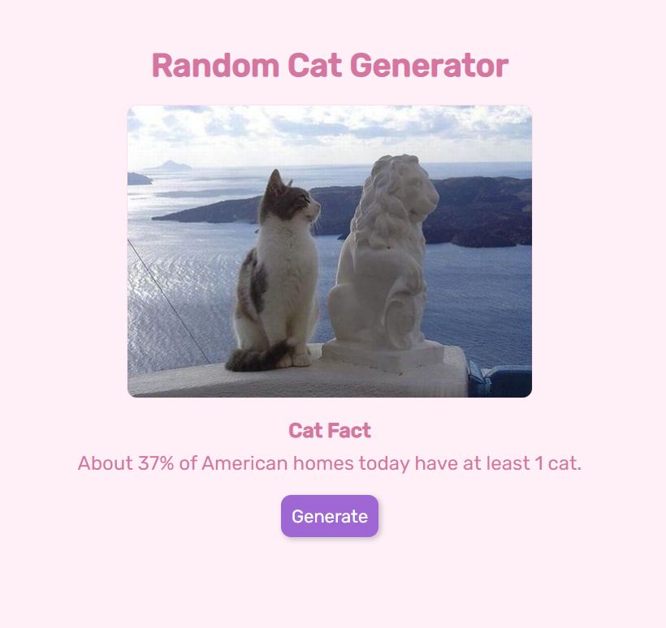

# CatGenerator
"https://k-erlikh.github.io/CatGenerator/"

Web application that generates random cat photo and fact.

<h2>How to use:</h2>

1. Press the "Generate" button to get a new fact and cat picture
2. Enjoy 

  

<h2>Information:</h2>

This website calls two different APIs:
- Cat Fact API: gets unique cat fact
- The Cat API: gets unique cat photo

JavaScript's fetch method was used to get the API calls.
This website is not published yet.

